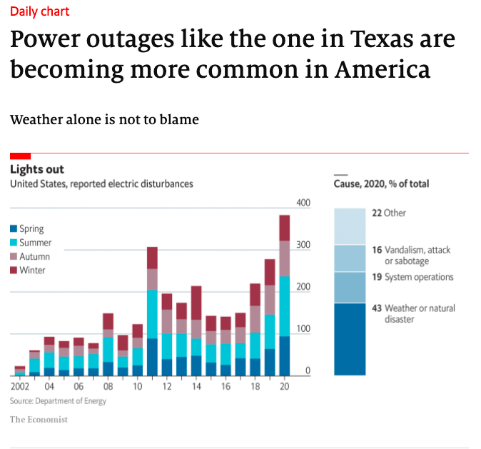
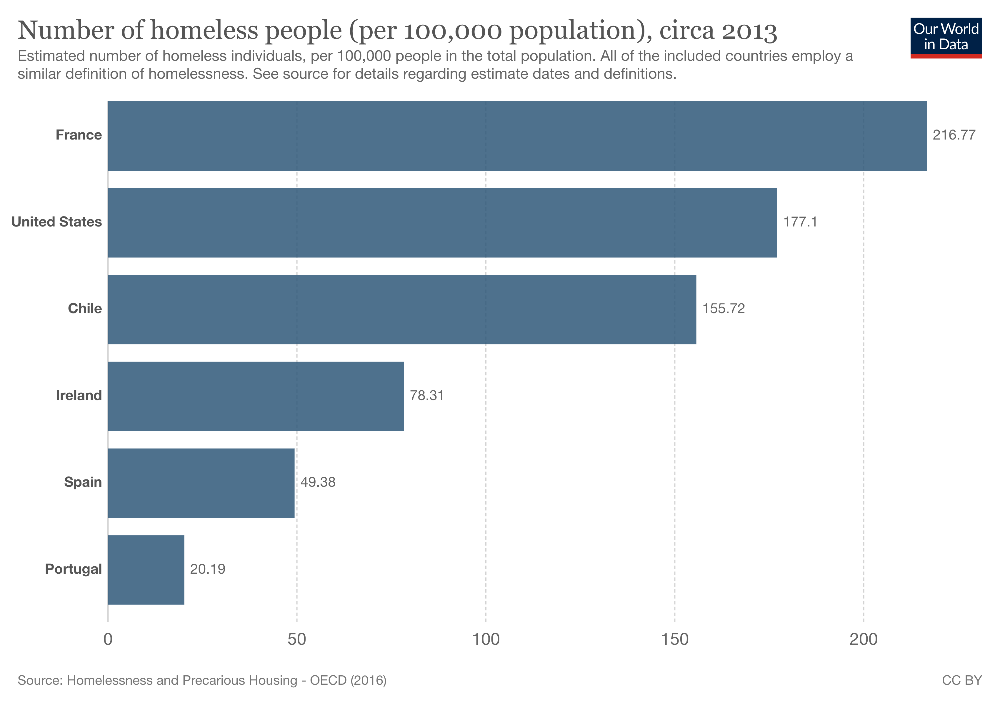

```{r xaringan-themer, include=FALSE, warning=FALSE}
library(xaringanthemer)
style_mono_light(
  base_color = "#042856", 
  header_color = "#7cacd4",
  title_slide_text_color = "#7cacd4",
  link_color = "#0000FF",
  text_color = "#000000",
  background_color = "#FFFFFF",
  header_h1_font_size ="2.00rem"
  )
```

```{r xaringan-scribble, echo=FALSE}
xaringanExtra::use_scribble() #activate for the pencil
xaringanExtra::use_panelset() #panel set
```


```{r, echo=FALSE, purl=FALSE, message = FALSE}
knitr::opts_chunk$set(comment = "#>", purl = FALSE, fig.showtext = TRUE, retina = 2)
```


class: left

# Outline

* What is categorical data?
* Introduction to `forcats` package.


---

class: center, middle

# Categorical Data

```{r echo=FALSE, out.height='100%', out.width='60%'}
  
```

---

#### Some Basic Terminology

- We have **two types** of data:
  - **Numerical** (`Quantitative`) data and
  - **Non-Numerical** (`Qualitative`) data.  
  
---

#### Numerical (Quantitative) data

- Takes on **number values**:
  - **Discrete:** These are integer valued data: 
      - How old are you? Answer: 25, 34, 45.
      - How many friends do you have on Facebook? Answer: 50, 100, 400.
 - **Continuous:** These are numbers that can take on **infinite
     values** within some range of values. 
      - What is your monthly income? Answer: 1525.56 TL, 879.45 TL.
      - What is your weight? Answer: 65.4 kg, 74.64 kg.
- We can make arithmetic operations on numerical data such as addition, subtraction multiplication, division etc.

---
#### Non-numerical (Qualitative) data
- It is also known as **categorical** data since it can take on some number of **distinct categories** such as eye color (brown, blue, green), computer brand (HP, Toshiba, Lenovo) and so on.
- We therefore typically treat those kinds of non-numerical fields as pure **character** data.
- However, the categories are generally **limited** and **distinct**, and  we can represent them by **numbers** and each category can be referred as `levels`.

---
- Categorical data may be **unordered categorical data**, which is also known as **nominal data**.
- For example, a survey asked Americans their favorite type of pizza:

|Category           |Level Number  | 
|:------------------|:------------:|
|NY Thin Crust      |1             |
|Chicago Deep Dish  |2             |
|California         |3             |


- There are **3** distinct **answers**, where each answer can be considered as one of the levels of pizza type variable.
---
- The numbers (**level numbers**) are **basically placeholders** for each category level, and is meant for us to work with it easier in a programming language. 
- If we get the following responses from 5 participants:
  - NY Thin Crust, NY Thin Crust, Chicago Deep Dish, Chicago Deep Dish, California
- Then we can code them as:
  - 1,1,2,2,3.

---
#### Create factors
- We can create a factor in `R`
using either the `factor()` function, or by reclassifying another vector type using `as.factor()`.

```{r}
# take the survey responses from previous 
x <- c(1,1,2,2,3)
x <- factor(x, levels = c(1, 2, 3), 
               labels = c("NY Thin Crust", "Chicago Deep Dish","California"))
                                                        
x
class(x)
```

---
- **Categorical data** can be ordered, which is also known as **ordinal data**. 
- For example, we may have a survey question with the following categories:

|Category      |Level Number  | 
|:-------------|:------------:|
|Very Unlikely |1             |
|Unlikely      |2             |
|Uncertain     |3             |
|Likely        |4             | 
|Very Likely   |5             | 

- These are not numerical data, because the _level number_ is merely a placeholder for the category, and we can not do arithmetic on these. 
- Since there is some order between categories, this is actually an `Ordinal` variable.
---

```{r}
#let's say we have the following sample from participants
x <- c(5, 2, 1, 2, 5, 2, 1, 5, 2, 5, 1, 1, 2)
x <- factor(x, levels = c(1, 2, 3, 4, 5), 
               labels = c("Very Unlikely", "Unlikely ", "Uncertain", "Likely", "Very Likely"), 
               ordered = TRUE)                                        
           
x
```

---

# Bar Charts

- Bar charts are useful for displaying **frequencies of categorical variables**.
- Each level of the categoric variable is represented as a **bar**. 
- The height of the bar represents its frequency. 
- We can plot a bar plot in `gpplot2` with [geom_bar()](https://ggplot2.tidyverse.org/reference/geom_bar.html) function.  


💡 **Do not confound bar chart with histogram**. A histogram has only a numeric variable as input and shows its distribution. 

---

```{css echo=FALSE}
.pull-left {
  float: left;
  width: 50%;
}
.pull-right {
  float: right;
  width: 50%;
}
```

#### Example: USA Electric Disturbances 

.pull-left[
```{r echo=FALSE, out.height='100%', out.width='100%'}
  
```
]


.pull-right[
* "... a winter storm led to power outages across the state, leaving millions of Texans in the dark".
* "The United States suffered 383 “electric disturbance events” in 2020, according to the Department of Energy (DoE), up from 150 in 2017".
* "Causes range from sabotage and vandalism to fuel-supply problems and earthquakes".
* **"But according to the DoE’s data, outages are more frequent in spring and autumn, as well as summer and winter, suggesting that more than just weather is behind the recent surge in blackouts (see chart)."**
]

[Source](https://www.economist.com/graphic-detail/2021/03/01/power-outages-like-the-one-in-texas-are-becoming-more-common-in-america)

---
#### USA Electric Disturbances Data
- Monthly electric disturbance data, which motivates the Economist graphic, is available at [US Energy Department](https://www.oe.netl.doe.gov/OE417_annual_summary.aspx) year by year.
- Due to inconsistent formats in the `.xls` files, we will be working with the data through the years 2016-2020 only.
- Let's first import data into `R`. 

```{r}
#import data
#skip the first row, which is all about table title.
#the next row is the column name.
library(readxl)
electric_data_2016 <- read_excel("data/2016_Annual_Summary.xls", skip=1) 
electric_data_2017 <- read_excel("data/2017_Annual_Summary.xls", skip=1)
electric_data_2018 <- read_excel("data/2018_Annual_Summary.xls", skip=1)
electric_data_2019 <- read_excel("data/2019_Annual_Summary.xls", skip=1)
electric_data_2020 <- read_excel("data/2020_Annual_Summary.xls", skip=1)
```

---
- All spreadsheets are of 
the same form. We can join these tables row by row by `full_join()` function in `dplyr`:

```{r, message=FALSE, warning=TRUE}
library(dplyr)
#bind the rows
full_disturbance <- 
             electric_data_2016 %>% 
             full_join(electric_data_2017) %>% 
             full_join(electric_data_2018) %>% 
             full_join(electric_data_2019) %>% 
             full_join(electric_data_2020) 
#View(full_disturbance) 
#str(full_disturbance)
head(full_disturbance,3)
```

---

- Let's create a new factor column variable called **Season** by categorizing the months into seasons.

```{r}
disturbance <- 
             full_disturbance %>% 
             mutate(Season = case_when(Month %in% c("March", "April", "May") ~ "Spring",
                                       Month %in% c("June", "July", "August") ~ "Summer",
                                       Month %in% c("September", "October", "November") ~ "Autumn",
                                       TRUE ~"Winter")) %>%  # creates a character variable first
            mutate(Season = factor(Season, levels=c("Winter", "Spring", "Summer", "Autumn"))) %>%  #convert the character variable into a factor. use levels argument now only.
            relocate(Season, .after = Month) #locate the season variable right after the month variable
#View(disturbance) 
```

```{r}
#Check that season is a factor with four levels.
str(disturbance)      
```

---

- Let's get the levels of the season variable.

```{r, message=FALSE, warning=FALSE}
library(dplyr)
disturbance %>% 
   #use dplyr::pull which acts like $ to get the variable
  pull(Season) %>% 
   #let us get the number placeholder attached to each category
    levels()
```

- Notice that `levels` are in the order we defined above!.. 

---

- Let's change the order of levels (do at home). 

```{r}
disturbance %>% 
   mutate(Season = factor(Season, levels = c("Spring", "Summer", "Autumn", "Winter"))) %>% 
   pull(Season) %>% 
   levels()
#did not save the data, will not affect the results          
```

---

- Let's count the number of electric disturbances over the seasons now.

```{r}
seasonal_disturbance <- disturbance %>% 
                         count(Season)             
#View(seasonal_disturbance)
```

---

- Count the number of electric disturbances in each year by season.

```{r}
yearly_disturbance <- disturbance %>% 
                             group_by(Year) %>% 
                             count(Season)  
                                
#View(yearly_disturbance)
```

---
#### Make a global theme for all graphics

- We are going to use the same `theme` settings today. So, let's fix them so that we can save some
space in our codes.


```{r}
library(ggplot2)
# first select a theme type by theme_set()
mytheme <- theme_set(theme_minimal()) 
# then update this theme with additional settings.
mytheme <- theme_update(panel.grid = element_line(linetype = "solid", size = 0.4),
                        panel.grid.major.x = element_blank(), 
                        panel.grid.minor= element_blank(), 
                        plot.title = element_text(face="bold"), 
                        plot.caption = element_text(hjust = 0))
#these theme setting will applied onto all graphics we are going to produce today.
```


---
.panelset[

.panel[.panel-name[Code]
- Now get a bar plot of electric disturbances across seasons ignoring the year attribute.

```{r eval=F}
library(ggplot2)
# get the frequencies by season first.
# you are preparing your data
# x must be a factor
disturbance %>% 
          count(Season) %>% 
ggplot(aes(x=Season, y=n)) +
    geom_bar(stat="identity", fill="#1c4966") +
  #stat:identity says that y is the raw frequencies.
  #some data sets may not involve raw frequencies. 
  #fill: fill-in the bar.
    scale_y_continuous(limits = c(0, 400)) +
  #adjust the y-axis limits between 0 and 400.
    labs(title="Lights out", 
         subtitle="United States, reported electric disturbances",
         y="", x="", 
         caption="Source: The Department of Energy") 
```
]

.panel[.panel-name[Output]

```{r echo=F, out.width="50%"}
library(ggplot2)
# get the frequencies by season first.
# you are preparing your data
# x must be a factor
disturbance %>% 
          count(Season) %>% 
ggplot(aes(x=Season, y=n)) +
    geom_bar(stat="identity", fill="#1c4966") +
  #stat:identity says that y is the raw frequencies.
  #some data sets may not involve raw frequencies. 
  #fill: fill-in the bar.
    scale_y_continuous(limits = c(0, 400)) +
  #adjust the y-axis limits between 0 and 400.
    labs(title="Lights out", 
         subtitle="United States, reported electric disturbances",
         y="", x="", 
         caption="Source: The Department of Energy") 
```
]

]


---
#### Side-by-Side (Grouped) Bar Plot

.panelset[

.panel[.panel-name[Code]
- Now plot the number of electric disturbances by season (level1) per year (level2). This is called as a side-by-side or grouped bar plot:
```{r, eval=F}
disturbance %>% 
           group_by(Year) %>% 
            count(Season) %>% 
ggplot(aes(x=Year, y=n, fill=Season)) +
    geom_bar(stat="identity", position="dodge") +
  #position = "dodge": side-by-side
    scale_y_continuous(limits = c(0,150)) +
  #adjust the y-axis limits between 0 and 150.
    labs(title="Lights out", 
         subtitle="United States, reported electric disturbances",
         y="", x="", 
         caption="Source: The Department of Energy") +
  #the variable Season is mapped to color fill. With scale_fill_manual we can map each factor
  #level of Season to different colors.
     scale_fill_manual(values=c("Winter"="#a32328", "Spring"="#1c4966", "Summer"="#45b6fe", "Autumn"="#d6bcc4"))
# More info: http://www.cookbook-r.com/Graphs/Legends_(ggplot2)/
```
]

.panel[.panel-name[Output]
```{r, echo=F, out.width="50%"}
disturbance %>% 
           group_by(Year) %>% 
            count(Season) %>% 
ggplot(aes(x=Year, y=n, fill=Season)) +
    geom_bar(stat="identity", position="dodge") +
  #position = "dodge": side-by-side
    scale_y_continuous(limits = c(0,150)) +
  #adjust the y-axis limits between 0 and 150.
    labs(title="Lights out", 
         subtitle="United States, reported electric disturbances",
         y="", x="", 
         caption="Source: The Department of Energy") +
  #the variable Season is mapped to color fill. With scale_fill_manual we can map each factor
  #level of Season to different colors.
     scale_fill_manual(values=c("Winter"="#a32328", "Spring"="#1c4966", "Summer"="#45b6fe", "Autumn"="#d6bcc4"))
# More info: http://www.cookbook-r.com/Graphs/Legends_(ggplot2)/
```
]


]

---
class: center, middle

# Forcats
  

---
# forcats package

- The [forcats](https://forcats.tidyverse.org/articles/forcats.html) is an `R` package to provide a suite of tools that solve common problems with categorical data,
where `forcats` is **for** **cat**egorical data. 
- First, to be able to use the functionality of `forcats` we have to load the package: 

```{r}
#library(tidyverse) or
library(forcats)
```

- The common functions in the package start with `fct_*()`.

|Function           | Description                                                      |
|-------------------|------------------------------------------------------------------|
|`fct_relevel()`    | Changing the order of a factor by hand.                          |
|`fct_infreq()`     | Reordering a factor by the frequency of values.                  |
|`fct_rev()`        | Reverse the order of factor levels.                              |
|`fct_reorder()`    | Reordering a factor by another variable.                         |

---

```{r, eval=F}
# In class: for online lecture only. to save time.
library(ggplot2)
disturbance %>% 
  #mutate(Season = fct_relevel(Season, "Spring", "Summer", "Autumn", "Winter")) %>% #<<
  #first argument is a factor, the rest are labels listed sequentially, not in a vector 
  #form.
  #mutate(Season = fct_relevel(Season, sort)) %>% #<<
  #sorts alphabetically
  #mutate(Season = fct_infreq(Season)) %>% #<<
  #decreasing
  #mutate(Season = fct_rev(fct_infreq(Season))) %>% #<<
  #increasing
    count(Season) %>% 
ggplot(aes(x=Season, y=n)) +
    geom_bar(stat="identity", fill="#1c4966") +
  #stat:identity gives the raw frequencies, fill: fill-in the bar.
    scale_y_continuous(limits = c(0, 400)) +
  #adjust the y-axis limits between 0 and 400.
    labs(title="Lights out", 
         subtitle="United States, reported electric disturbances",
         y="", x="", 
         caption="Source: The Department of Energy") 
```


---

.panelset[
.panel[.panel-name[Code]
- Re-visit the bar plot example of electric disturbances across seasons ignoring the year.
```{r, eval=F}
library(ggplot2)
disturbance %>% 
    count(Season) %>% 
ggplot(aes(x=Season, y=n)) +
    geom_bar(stat="identity", fill="#1c4966") +
  #stat:identity gives the raw frequencies, fill: fill-in the bar.
    scale_y_continuous(limits = c(0, 400)) +
  #adjust the y-axis limits between 0 and 400.
    labs(title="Lights out", 
         subtitle="United States, reported electric disturbances",
         y="", x="", 
         caption="Source: The Department of Energy") 
```
- Note that the order of season levels appear as defined before.
- For factors, `ggplot` _generally places visual elements in the order defined by the levels_.
]

.panel[.panel-name[Output]
```{r, echo=F, out.width="50%"}
library(ggplot2)
disturbance %>% 
    count(Season) %>% 
ggplot(aes(x=Season, y=n)) +
    geom_bar(stat="identity", fill="#1c4966") +
  #stat:identity gives the raw frequencies, fill: fill-in the bar.
    scale_y_continuous(limits = c(0, 400)) +
  #adjust the y-axis limits between 0 and 400.
    labs(title="Lights out", 
         subtitle="United States, reported electric disturbances",
         y="", x="", 
         caption="Source: The Department of Energy") 
```
]


]


---
# fct_relevel()

- We may specify the order ourselves (i.e. manually order the levels) by using `fct_relevel()`.
- Let's order them such that Spring comes first, then Summer, Autumn, and Winter, respectively.
---

.panelset[
.panel[.panel-name[Code]
```{r, eval=F}
library(forcats)
library(ggplot2)
disturbance %>% 
  mutate(Season = fct_relevel(Season, "Spring", "Summer", "Autumn", "Winter")) %>% #<<
  #first argument is a factor, the rest are labels listed sequentially, not in a vector 
  #form.
  #mutate(Season = fct_relevel(Season, sort)) %>% #<<
  #sorts alphabetically
  count(Season) %>% 
ggplot(aes(x=Season, y=n)) +
    geom_bar(stat="identity", fill="#1c4966") +
  #stat:identity gives the raw frequencies, fill: fill-in the bar.
    scale_y_continuous(limits = c(0, 400)) +
  #adjust the y-axis limits between 0 and 400.
    labs(title="Lights out", 
         subtitle="United States, reported electric disturbances",
         y="", x="", 
         caption="Source: The Department of Energy") 
```
]

.panel[.panel-name[Output]
```{r, echo=F, out.width="50%"}
library(forcats)
library(ggplot2)
disturbance %>% 
  mutate(Season = fct_relevel(Season, "Spring", "Summer", "Autumn", "Winter")) %>% #<<
  #first argument is a factor, the rest are labels listed sequentially, not in a vector 
  #form.
  #mutate(Season = fct_relevel(Season, sort)) %>% #<<
  #####sorts alphabetically####
  count(Season) %>% 
ggplot(aes(x=Season, y=n)) +
    geom_bar(stat="identity", fill="#1c4966") +
  #stat:identity gives the raw frequencies, fill: fill-in the bar.
    scale_y_continuous(limits = c(0, 400)) +
  #adjust the y-axis limits between 0 and 400.
    labs(title="Lights out", 
         subtitle="United States, reported electric disturbances",
         y="", x="", 
         caption="Source: The Department of Energy") 
```
]

]

  
---
# fct_infreq()

- The `fct_infreq()` orders the levels from most frequent to least frequent.

---
.panelset[
.panel[.panel-name[Code]
```{r, eval=F}
library(forcats)
library(ggplot2)
disturbance %>% 
    mutate(Season = fct_infreq(Season)) %>% #<<
    #decreasing
    count(Season) %>% 
ggplot(aes(x=Season, y=n)) +
    geom_bar(stat="identity", fill="#1c4966") +
  #stat:identity gives the raw frequencies, fill: fill-in the bar.
    scale_y_continuous(limits = c(0, 400)) +
  #adjust the y-axis limits between 0 and 400.
    labs(title="Lights out", 
         subtitle="United States, reported electric disturbances",
         y="", x="", 
         caption="Source: The Department of Energy") 
```
]

.panel[.panel-name[Output]
```{r, echo=F, out.width="50%"}
library(forcats)
library(ggplot2)
disturbance %>% 
    mutate(Season = fct_infreq(Season)) %>% #<<
    #decreasing
    count(Season) %>% 
ggplot(aes(x=Season, y=n)) +
    geom_bar(stat="identity", fill="#1c4966") +
  #stat:identity gives the raw frequencies, fill: fill-in the bar.
    scale_y_continuous(limits = c(0, 400)) +
  #adjust the y-axis limits between 0 and 400.
    labs(title="Lights out", 
         subtitle="United States, reported electric disturbances",
         y="", x="", 
         caption="Source: The Department of Energy")  
```
]

]
  
---
# fct_rev()

- The `fct_rev()` reverses the order.

---
.panelset[
.panel[.panel-name[Code]
```{r, eval=F}
library(forcats)
library(ggplot2)
disturbance %>% 
  mutate(Season = fct_rev(fct_infreq(Season))) %>% #<<
   #increasing
   count(Season) %>% 
ggplot(aes(x=Season, y=n)) +
    geom_bar(stat="identity", fill="#1c4966") +
  #stat:identity gives the raw frequencies, fill: fill-in the bar.
    scale_y_continuous(limits = c(0, 400)) +
  #adjust the y-axis limits between 0 and 400.
    labs(title="Lights out", 
         subtitle="United States, reported electric disturbances",
         y="", x="", 
         caption="Source: The Department of Energy") 
```
]

.panel[.panel-name[Output]
```{r, echo=F, out.width="50%"}
library(forcats)
library(ggplot2)
disturbance %>% 
 mutate(Season = fct_rev(fct_infreq(Season))) %>% #<<
  #increasing
  count(Season) %>% 
ggplot(aes(x=Season, y=n)) +
    geom_bar(stat="identity", fill="#1c4966") +
  #stat:identity gives the raw frequencies, fill: fill-in the bar.
    scale_y_continuous(limits = c(0, 400)) +
  #adjust the y-axis limits between 0 and 400.
    labs(title="Lights out", 
         subtitle="United States, reported electric disturbances",
         y="", x="", 
         caption="Source: The Department of Energy")  
```
]

]

---

# Revisit Economist graphic (At home)

.panelset[
.panel[.panel-name[Code]
```{r, eval=F}
library(forcats)
library(ggplot2)
yearly_disturbance %>% 
  mutate(Season=fct_relevel(Season, "Spring", "Summer", "Autumn","Winter")) %>% 
ggplot(aes(x=Year, y=n, fill=Season)) + 
    geom_bar(stat="identity", position="stack") +
    #position:"stack": stack the bars
    labs(title = "Lights out", 
         subtitle = "United States, reported electric disturbances",
         y="", x="", 
         caption="Source: The Department of Energy") +
    #adjust the legend position. Since we would like to move the legend into figure area, we define vector of coordinates.
    theme(legend.position = c(.1, .7)) +
    #move the vertical axis to the right
    scale_y_continuous(position = "right") +
    #adjust the tick mark places and their labels accordingly
    scale_x_continuous(breaks = c(2016, 2017, 2018, 2019, 2020), labels =c("2016", "17", "18", "19", "20")) +
    #the variable Season is mapped to color fill. With scale_fill_manual we can map each factor
    #level of Season to different colors.
    scale_fill_manual(values=c("Spring"="#1c4966", "Summer"="#45b6fe", "Autumn"="#d6bcc4", "Winter"="#a32328"))
```
]

.panel[.panel-name[Output]
```{r, echo=F, out.width="40%"}
library(forcats)
library(ggplot2)
yearly_disturbance %>% 
  mutate(Season=fct_relevel(Season, "Spring", "Summer", "Autumn","Winter")) %>% 
ggplot(aes(x=Year, y=n, fill=Season)) + 
    geom_bar(stat="identity", position = position_stack(reverse = TRUE)) + 
    #position = position_stack(reverse = TRUE):  reverse the default stacking order
    #https://stackoverflow.com/questions/40862246/colour-scale-inversion-with-new-version-of-ggplot
    labs(title = "Lights out", 
         subtitle = "United States, reported electric disturbances",
         y="", x="", 
         caption="Source: The Department of Energy") +
    #adjust the legend position. Since we would like to move the legend into figure area, we define vector of coordinates.
    theme(legend.position = c(.1, .7)) +
    #move the vertical axis to the right
    scale_y_continuous(position = "right") +
    #adjust the tick mark places and their labels accordingly
    scale_x_continuous(breaks = c(2016, 2017, 2018, 2019, 2020), labels =c("2016", "17", "18", "19", "20")) + #, 
    #the variable Season is mapped to color fill. With scale_fill_manual we can map each factor
    #level of Season to different colors.
    scale_fill_manual(values=c("Spring"="#1c4966", "Summer"="#45b6fe", "Autumn"="#d6bcc4", "Winter"="#a32328")) 
   
```
]

]

---
#### Example: Homeless Data (At home)
- Let's focus on [Homeless data](https://ourworldindata.org/homelessness#:~:text=Homelessness%20remains%20an%20important%20policy,in%201%2C670%20Americans%20is%20homeless).
- We have number of homeless people for several countries in 2013.


```{r echo=FALSE, out.height='100%', out.width='50%'}
  
```

---
- Read the data into `R` first.
```{r}
homeless_data <- readr::read_csv("data/number-of-homeless-people-per-100000-population-circa-2013.csv", 
                            skip=1, col_names = c("Country", "Code", "Homeless_Total"))
#convert country into a factor with country levels.
homeless_data <- homeless_data %>%
   mutate(Country = factor(Country, levels=c("Chile","France","Ireland","Portugal","Spain","United States"))) 
#View(homeless_data)
#str(homeless_data)
```

---

.panelset[
.panel[.panel-name[Code]
```{r, eval=F}
homeless_data %>%  
  mutate(Country = fct_reorder(Country, Homeless_Total)) %>% 
  #fct_reorder: increasing
   ggplot(aes(x=Country, y=Homeless_Total)) + 
   geom_bar(stat = "identity", fill="#52708a") +
   labs(title = "Number of homeless people (per 100,000 population), circa 2013", 
       subtitle = "Estimated number of homeless individuals, per 100,000 people in the total population. All of the included\ncountries employ a similar definition of homelessness. See source for details regarding estimate dates and
definitions.", 
caption="Source:Homeless and Precarious Housing-OECD (2016)",
       x = "",    y = "") +
  theme_minimal() +
     theme(panel.grid.major= element_blank(), 
           panel.grid = element_line(linetype = "dashed", size = 0.7),
           plot.title = element_text(size = 14), 
           plot.subtitle = element_text(size = 9),
           plot.caption = element_text(hjust = -.25),
           axis.text.y = element_text(hjust = 1.4)) + 
  #align the plot horizontally
  coord_flip() +
  #note that coord_flip sorts data according to levels (from bottom to top).
  #combined with fct_reorder + coord_flip: sort from decreasing to increasing, places the lowest
  #value to bottom, the highest value to the top.
  geom_text(aes(label=round(Homeless_Total,2)), hjust= -0.2)
 #a few more adjustments needed!..

```
]

.panel[.panel-name[Output]
```{r, echo=F, out.width="50%"}
homeless_data %>%  
  mutate(Country = fct_reorder(Country, Homeless_Total)) %>% 
  #fct_reorder: increasing
   ggplot(aes(x=Country, y=Homeless_Total)) + 
   geom_bar(stat = "identity", fill="#52708a") +
   labs(title = "Number of homeless people (per 100,000 population), circa 2013", 
       subtitle = "Estimated number of homeless individuals, per 100,000 people in the total population. All of the included\ncountries employ a similar definition of homelessness. See source for details regarding estimate dates and
definitions.", 
caption="Source:Homeless and Precarious Housing-OECD (2016)",
       x = "",    y = "") +
  theme_minimal() +
     theme(panel.grid.major= element_blank(), 
           panel.grid = element_line(linetype = "dashed", size = 0.7),
           plot.title = element_text(size = 14), 
           plot.subtitle = element_text(size = 9),
           plot.caption = element_text(hjust = -.25),
           axis.text.y = element_text(hjust = 1.4)) + 
  #align the plot horizontally
  coord_flip() +
  #note that coord_flip sorts data according to levels (from bottom to top).
  #combined with fct_reorder + coord_flip: sort from decreasing to increasing, places the lowest
  #value to bottom, the highest value to the top.
  geom_text(aes(label=round(Homeless_Total,2)), hjust= -0.2)
 #a few more adjustments needed!..

```
]

]


---

- More example on `forcats` package available at:
  - [Wikelab](https://wilkelab.org/SDS375/slides/getting-things-in-order.html#28).
  - [Forcats](https://wrangle-r.rsquaredacademy.com/forcats.html).


---
# Attributions

- This lecture note is partially developed by following sources:
   - [McMasterl](https://github.com/sciencificity/forcats-tutorial/blob/master/forcats_tutorial.Rmd).


