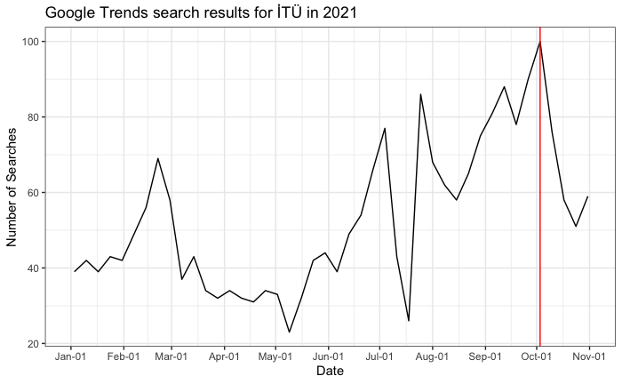
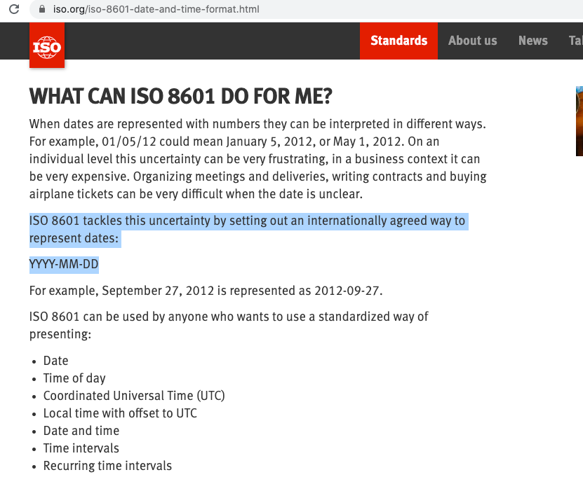

```{r xaringan-themer, include=FALSE, warning=FALSE}
library(xaringanthemer)
style_mono_light(
  base_color = "#042856", 
  header_color = "#7cacd4",
  title_slide_text_color = "#7cacd4",
  link_color = "#0000FF",
  text_color = "#000000",
  background_color = "#FFFFFF",
  header_h1_font_size ="2.00rem"
  )
```


```{r, echo=FALSE, purl=FALSE, message = FALSE}
knitr::opts_chunk$set(comment = "#>", purl = FALSE, fig.showtext = TRUE, retina = 2)
```


```{r xaringan-scribble, echo=FALSE}
xaringanExtra::use_scribble() #activate for the pencil
xaringanExtra::use_xaringan_extra(c("tile_view", "animate_css", "tachyons"))
xaringanExtra::use_panelset() #panel set
```


class: left

# Outline

* Introduction to `lubridate` package.  
  *01-lubridate_casestudy.Rmd
  
---

# Overview

- Up to now, we have dealt with: numeric, character, logical, and factor type of vectors. 
- In data science projects, we may encounter variables that are **dates** and **times**. 
- **Dates** and **times** can be used to quantify when exactly a certain event occurs and can help us understand chronological relationships. 

---
class: middle, center

#### What do you see in this graphic?

```{r echo=FALSE, out.height='100%', out.width='80%'}
  
```

---

#### Date-time functions/classes

- Luckily, `R` provides several options for dealing with **date** and **date/time** data. 
- Just as numbers and strings have their own class in `R`, **date** and **date/time** objects have their own class too. 
- In base `R`, the built-in `as.Date()` function with `Date` class handles dates (without times);  and the `as.POSIXct()` function with `POSIXct` class and `as.POSIXlt()` function with `POSIXlt` class allow for dates and times with control for **time zones**. 

|Type           |Function      |Class     | Description                                         |
|:--------------|:-------------|:---------|:----------------------------------------------------|
|date           |`as.Date()`   |`Date`    | represent calendar dates.                           |
|date-time      |`as.POSIXct()`|`POSIXct` | stores seconds since epoch (since `January 1, 1970`).|
|date-time      |`as.POSIXlt()`|`POSIXlt` | stores a list of day, month, year, hour, minute, second, etc.|

- Note: POSIX stands for `Portable Operating System Interface` and it is a family of standards specified by the `IEEE Computer Society` for maintaining compatibility between different operating systems. 
- The POSIX classes are especially useful when time zone manipulation is important. 
- `ct` stands for calendar time. 

---
- Computer languages usually use `January 1, 1970`
as the _epoch_ which is an origin (reference) day so that the dates can be converted to numbers. Dates older than the origin are stored as negative integers.
- Similarly, in `R`, except for the `POSIXlt` class, dates are stored internally as the number of days or seconds from `January 1, 1970`. 
- The `POSIXlt` class stores date/time values as a list of components (day, month, year, etc.) making it easy to extract these parts.
-  Unless you need the list nature of the `POSIXlt` class, the `POSIXct` class is the usual choice for storing dates in `R`.

---

- Let's get the current system date and time.

```{r}
# get system date
Sys.Date()
```

```{r}
# check the class
class(Sys.Date())
```

```{r}
# get the system time
Sys.time()
```

```{r}
# check the class
class(Sys.time())
```

---
class: middle, center

```{r, echo=F, out.width="60%"}

```

---

```{css echo=FALSE}
.pull-left {
  float: left;
  width: 50%;
}
.pull-right {
  float: right;
  width: 50%;
}
```

#### Date format

.pull-left[
- There are **many ways** to write a date and date formats vary **across the world**. 
- Having **different formats** could be confusing for people that come from different countries to understand. 
- The [ISO 8601](https://www.iso.org/iso-8601-date-and-time-format.html) recommends writing the date as year, then month, then the day: `YYYY-MM-DD` and uses the 24 hour clock system.
- This default format used in `R` is also the `ISO 8601 standard` for date/time. 

```{r}
Sys.time()
```

]


.pull-right[
```{r echo=FALSE, out.height='100%', out.width='100%'}
  
```
]

---
- We can create date objects through `as.Date()` function in base `R`.
```{r}
#check
class(2021-10-04)
class("2021-10-04")
#create a data object in base R
school_start_date <- as.Date("2021-10-04")
class(school_start_date)
#number of days since 1970-01-01
unclass(school_start_date)
```

```{r}
#How long has been since the school started?
Sys.Date()-school_start_date
```

---
- Many of the statistical summary functions, like mean, min, max, etc are able to transparently handle date objects. 

```{r}
important_dates <- as.Date(c("2021-11-01","2021-10-01","2021-09-01"))
important_dates
```

```{r}
min(important_dates)
max(important_dates)
```

- The `by=argument` to the `seq()` function can be specified in any units of time that the function accepts, making it very easy to generate sequences of dates. 

```{r}
seq(from=as.Date('2021-10-04'), to=as.Date('2022-01-01'), by='10 days') #1 day, 10 days, 2 weeks, 3 months
```

- where unit of time in `by` argument can be: "secs", "mins", "hours", "days", "weeks", and "months".
---

- The `as.Date()` function allows a variety of **input formats** through the `format` input argument. 

| Code | Value         |
|:-----|:--------------|
| %d	 | Day of the month (decimal number)|
| %m	 | Month (decimal number)|
| %b	 | Month (abbreviated)|
| %B	 | Month (full name)|
| %y	 | Year (2 digit)|
| %Y	 | Year (4 digit)|

```{r}
#convert it into a data object with YYYY-MM-DD 
#format argument tells the input structure, output is always in YYYY-MM-DD
as.Date('15-11-2021', format = '%d-%m-%Y')
```

```{r}
#convert it into a data object with YYYY-MM-DD 
#format argument tells the input structure, output is always in YYYY-MM-DD
as.Date('November 15, 2021', format='%B %d, %Y')
```

---
- You can also change the format of the date into another date form through `format()` function.

```{r}
Sys.Date()
format(Sys.Date(), '%B %d, %Y')
```

- See YAML part of my slides!..

```{r, eval=F}
---
title: "MAT381E-Week 7: Handling dates in data"
subtitle: ""
author: "Gül İnan"
institute: "Department of Mathematics<br/>Istanbul Technical University"
date: "`r format(Sys.Date(), '%B %d, %Y')`"
---
```

---
- The default input format for `POSIX` dates consists of the year, followed by the month and day, separated by dashes; for date/time values, the date may be followed by **white space** and a time in the form `hour:minutes:seconds` or `hour:minutes`; thus, the following are examples of valid `POSIX` date or date/time objects:


```{r}
#create POSIX objects
#no need format argument since it is already in YYYY-MM-DD format
release_date <- as.POSIXct("2019-12-12")
release_date
class(release_date)
unclass(release_date) 
```

```{r}
#create POSIX objects
release_date <- as.POSIXct("2019-12-12 08:05:03")
class(release_date)
release_date
```

---

```{r}
#create POSIX objects
release_date <- as.POSIXlt("2019-12-12 08:05:03")
class(release_date)
release_date
release_date$hour #you can get the components
```

---

- Use:
 - `Date` when there is no time component,
 - `POSIXct` when dealing with time and time zones, and
 - `POSIXlt` when you want to access/extract the different components.
 
---

#### Example: Google Trends results of İTÜ
- I imported _Google Trend Search_ results for İTÜ between January 1, 2021 and November 1, 2021 via  [gtrendsR](https://cran.r-project.org/web/packages/gtrendsR/) package. Note that my query results are very limited and restricted to Turkey location only.

.panelset[
.panel[.panel-name[Data]
```{r, echo=F, eval=F, warning=F, message=F}
#install.packages("gtrendsR")
library(gtrendsR)
#i need dplyr and tidyr
library(tidyverse)

# Download google trends query for the word "İTÜ
# between August 10 and November 10, 2021.
google_trends <- gtrends("İTÜ", 
                         time = "2021-01-01 2021-11-01", 
                         geo = "TR")[[1]]
google_trends_itu <- google_trends %>% 
                 pivot_wider(names_from = c("keyword", "geo"), values_from = "hits") %>%
                 select(-time, -gprop, -category)
# Convert date variable
google_trends_itu$date <- as.Date(google_trends_itu$date, "%Y-%m-%d")

# Mutate factor to numeric and reorder
#google.trends <- google.trends %>%
#  mutate_if(is.factor, as.character) %>%
#  mutate_if(is.character, as.numeric)
#head(google.trends)
write_csv(google_trends_itu, "data/google_trends_itu.csv")
```

```{r, warning=F, message=F}
google_trends <- readr::read_csv("data/google_trends_itu.csv")
head(google_trends, 3)
```

- The variable `date` in `google.trends` data looks like a character. But, actually, it is `date`:

```{r, message=FALSE, warning=FALSE}
library(tidyverse)
google_trends %>% 
  str()
class(google_trends$date)

```

]

.panel[.panel-name[Code]

```{r, eval=F}
ggplot2::ggplot(data = google_trends) +
      geom_line(aes(x = date, y = İTÜ_TR)) +
      scale_x_date(limits = as.Date(c("2021-01-01","2021-11-01")), 
                  date_breaks = "1 month" )+
      geom_vline(aes(xintercept = as.Date("2021-10-03")), color="red") +
      ggtitle("Google Trends search results for İTÜ in 2021") +
      ylab("Number of Searches") +
      xlab("Date") +
      theme_bw() 
```
]

.panel[.panel-name[Output]
```{r, echo=F, out.width="40%"}
ggplot2::ggplot(data = google_trends) +
      geom_line(aes(x = date, y = İTÜ_TR)) +
      scale_x_date(limits = as.Date(c("2021-01-01","2021-11-01")), 
                  date_breaks = "1 month" )+
      geom_vline(aes(xintercept = as.Date("2021-10-03")), color="red") +
      ggtitle("Google Trends search results for İTÜ in 2021") +
      ylab("Number of Searches") +
      xlab("Date") +
      theme_bw() 
```
]

]

---
- Plotting functions in `ggplot2` are aware of dates which means that, for example, a scatter plot can use the **numeric representation** 
to decide on the position of the point, but include the **string in the labels** via `scale_*_date()` function:

.panelset[
.panel[.panel-name[Code]
```{r, eval=F, out.width="40%", warning=F, message=FALSE}
library(ggplot2)
ggplot(data = google_trends) +
      geom_line(aes(x = date, y = İTÜ_TR)) +
      scale_x_date(limits = as.Date(c("2021-01-01","2021-11-01")), #<<
                   date_breaks = "1 month", date_labels = "%b-%d") + #<<
      geom_vline(aes(xintercept = as.Date("2021-10-03")), color="red") +
      ggtitle("Google Trends search results for İTÜ in 2021") +
      ylab("Number of Searches") +
      xlab("Date") +
      theme_bw() 
#more: https://www.statworx.com/at/blog/customizing-time-and-date-scales-in-ggplot2/
```
]

.panel[.panel-name[Output]
```{r, echo=F, out.width="40%", warning=F, message=FALSE}
library(ggplot2)
ggplot(data = google_trends) +
      geom_line(aes(x = date, y = İTÜ_TR)) +
      scale_x_date(limits = as.Date(c("2021-01-01","2021-11-01")), 
                   date_breaks = "1 month", date_labels = "%b-%d") + #<<
      geom_vline(aes(xintercept = as.Date("2021-10-03")), color="red") +
      ggtitle("Google Trends search results for İTÜ in 2021") +
      ylab("Searches") +
      xlab("Date") +
      theme_bw() 
#more: https://www.statworx.com/at/blog/customizing-time-and-date-scales-in-ggplot2/
```
]

]


---

class: middle, center

   

---
# lubridate package

- The `tidyverse ecosystem` includes [lubridate](https://lubridate.tidyverse.org/) package for dealing with **date-times** and **time-spans**.  
- It is fast and user friendly helping with:
   - Parsing of date-time data,
   - Extraction and updating of components of a date-time, and
   - Algebraic manipulation on date-time and time-span objects.

- First, to be able to use the functionality of `lubridate` we have to load the package: 

```{r message=FALSE, warning=FALSE}
# The easiest way to get lubridate is to load the whole tidyverse:
# library(tidyverse) or
# Alternatively, load just lubridate:
library(lubridate)
```


---
#### Parsing dates and times (Converting strings or numbers to date-times)
- The `lubridate` package has a number of functions to convert **strings** to  **date** and **date-time** objects.
- Here, we simply try to **match the characters to the pattern of the date-time** we are trying to parse.
- The goal is to end up with a date-time in the form: `YYYY-MM-DD HH:MM:SS`.
- For parsing the date, in `lubridate` we can use a combination of the letters ‘d’, ‘m’, ‘y’ (standing for day, month, year). 
- Use the functions below whose name replicates the order.

|Function  |Description                                | 
|----------|-------------------------------------------|
|`ymd()`   |converts characters into YYYY-MM-DD format.|
|`ydm()`   |converts characters into YYYY-MM-DD format.|
|`mdy()`   |converts characters into YYYY-MM-DD format.| 
|`dmy()`   |converts characters into YYYY-MM-DD format.|
|`hms()`   |converts characters into HH:MM:SS format.  |
|`hm()`    |converts characters into HH:MM format.     |
|`h()`     |converts characters into HH format.        |

---

```{r, warning=FALSE, message=FALSE}
# When is International Women's day?
library(lubridate)
#pattern is year, month, day
ymd("20210308")
#pattern is year, day, month
ydm("20210803")
#pattern is month, day, year
mdy("03-08-2021")
#pattern is day, month, year
dmy("08/03/2021")
#all of them are converted to the YYYY-MM-DD format.
```

---
```{r}
#if we thing that these strings are in year-month-day format,
#then put all of them in a standard year-month-day format.
x <- c(20090101, "2009-01-02", "2009 01 03", "2009-1-4",
       "2009-1, 5", "Created on 2009 1 6", "200901 !!! 07")
ymd(x)
```

---
- A very similar technique can be used to parse times:

```{r}
#there is no other functions such as smh() etc.
#other versions are hm(), h()
hms("20:30:10")
```

- Now if we come across a variable that includes a date and time we can join relevant functions together with an ‘_’ to parse a date-time.

```{r}
ymd_hms("2006/03/19 20:30:10")
ydm_hms("2006/19/03 20:30:10")
mdy_hms("03/19/2006 20:30:10")
dmy_hms("19/03/2006 20:30:10")
#all of them are converted to the YYYY-MM-DD hh:mm:ss format.
```

- The phrase **Coordinated Universal Time (UTC)** in the output represents the time-zone and by default should be UTC, this stands for universal time coordinated.

---
#### GET components of date-times

- We can use helper functions to get a relevant component in `data-time` objects.

|Function         |Description        | 
|-----------------|-------------------|
|`date()`         |Date component     | 
|`year()`         |Year component     | 
|`month(, label)` |Month component    | 
|`day()`          |Day of month       | 
|`week()`         |Week of the year   |
|`wday(, label)`  |Day of week        |
|`yday()`         |Day of year        |
|`hour()`         |Hour               |
|`minute()`       |Minute             |
|`second()`       |Second             |

---

```{r, eval}
womensday <- ymd("2021/03/08")
#replaces "/" with "-".
year(womensday)
month(womensday)
week(womensday)
#note that Sunday is accepted as the first day of the week
wday(womensday)
wday(womensday, label=TRUE)
yday(womensday)
```

---
#### SET components of date-time
- `lubridate` can be used to not only extract but also **change** parts of date-time objects.

```{r, eval=F}
month(womensday) <- 12
womensday

second(womensday) <- 99
womensday

# Use update function to change multiple values
womensday_up <- update(womensday, year = 1976, day = 16, month = 6, hour = 8)
womensday_up 
```

---
- In `R`, we can get the current time by typing `Sys.time()`. 

```{r}
Sys.time()
class(Sys.time())
```

- The `lubridate` package provides a slightly more advanced function, `now`, that permits you define the time zone:

```{r}
now()
#time in Turkey now
now("Turkey")
#time in US-Eastern cost now
now("US/Eastern")

```

- You can see all the available times zones with the `OlsonNames()` function.

---

- The `lubridate` also has a function to extract hours, minutes and seconds:

```{r}
now() %>% hour()
now() %>% minute()
now() %>% second()
```


---

- **Hands-on example:** Visit `01-lubridate_casestudy.Rmd` file.

```{r echo=FALSE, out.height='100%', out.width='80%'}
  
```
---
class: middle, center

```{r,echo=F, warning=F, message=F}
library(tidyverse)
seq(ymd("2021-04-01"),ymd("2021-04-30"),1) %>% walk(~cat(emo::moon(.x)))
```


---

- More at:
  - [Scale_date](https://ggplot2.tidyverse.org/reference/scale_date.html)
  - [Lubridate](https://rstudio-pubs-static.s3.amazonaws.com/422499_dcc2ed60c639458ba349b21e22059ac9.html#chapter-2---parsing-dates-with-lubridate).
  - [Dates and Times in R](https://www.stat.berkeley.edu/~s133/dates.html#:~:text=Dates%20stored%20in%20the%20POSIX,more%20accurate%20representation%20of%20times).
  - [Missing Dates](https://blog.exploratory.io/populating-missing-dates-with-complete-and-fill-functions-in-r-and-exploratory-79f2a321e6b5).
  - [Lubridate](https://wrangle-r.rsquaredacademy.com/lubridate.html).
 
---

# Attributions
- All images used in this slide are taken from the web.
- This lecture note is mainly developed by following sources:
   - [Source 1](https://github.com/datasciencelabs/2020/blob/master/03_wrangling/05_dates-and-times.Rmd),
   - [Source 2](https://eddatascienceees.github.io/tutorial-sian-phillips/), and
   - [Source 3](https://github.com/MeganBeckett/lubridate-heatmaps_tutorial/blob/master/code/lubridate_tutorial.Rmd).
   
   

 
   